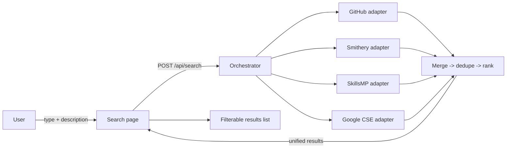

# AI Component Search Website — Design

**Date:** 2026-07-06
**Status:** Approved (design phase)

## Purpose

A website where a user describes an AI component — a **Skill**, **Agent**,
**Prompt**, or **MCP server** — and the site returns a unified, de-duplicated,
ranked list of links to open AI marketplaces and GitHub repositories for related
components. Curated marketplace adapters are queried first, with a Google search
fallback for broader coverage.

## Scope

**In scope**
- Browser UI: component-type selector + free-text description + results list.
- Thin backend that holds API keys and orchestrates source adapters.
- Curated adapters: **GitHub**, **Smithery**, **SkillsMP**.
- **Google Custom Search** fallback (domain-restricted), self-disabling when no key.
- Merge, de-duplicate, and rank results; filter results by source in the UI.

**Out of scope (future)**
- Additional adapters (Glama, Hugging Face, Agent.ai, LangChain Hub, GPT Store).
- User accounts, saved searches, ratings.
- Server-side caching / persistence.

## Architecture

**Next.js (App Router) + TypeScript**, single codebase. React UI plus a Next.js
API route (`/api/search`) as the thin backend that holds keys and orchestrates
source adapters. **Vitest** for tests. The existing CLI sample files
(`src/greet.ts`, `src/cli.ts`, `src/index.ts`, and their tests) are removed in
favor of the web app.

### Data flow



## Component-type → source routing

| Component type | Sources queried                          |
| -------------- | ---------------------------------------- |
| Skill          | SkillsMP, GitHub, Google                 |
| MCP server     | Smithery, GitHub, Google                 |
| Agent          | Smithery, GitHub, Google                 |
| Prompt         | GitHub, Google                           |

Routing is driven by each adapter's `supports(type)` method, so adding a source
later (e.g., Glama for agents) is a local change.

## Adapter interface (key abstraction)

Every source implements the same interface so sources can be added or removed
independently and tested in isolation.

```ts
type ComponentType = 'skill' | 'agent' | 'prompt' | 'mcp';
type AdapterId = 'github' | 'smithery' | 'skillsmp' | 'google';

interface SearchAdapter {
  id: AdapterId;
  supports(type: ComponentType): boolean;
  isEnabled(): boolean;              // false when required env keys are missing
  search(query: string, type: ComponentType): Promise<SearchResult[]>;
}

interface SearchResult {
  title: string;
  url: string;          // canonical link shown to the user
  githubUrl?: string;   // used as the de-duplication key when present
  description?: string;
  source: AdapterId;
  stars?: number;
}
```

## Merge, de-duplicate, rank

- **De-duplicate** by normalized canonical URL: lowercase host, strip trailing
  slash, and drop query/hash. GitHub-derived results are keyed by `owner/repo`.
  When duplicates collapse, keep the richest record and record all contributing
  sources.
- **Rank** with a simple, transparent score: curated-marketplace hits and higher
  GitHub star counts rank first; Google fallback results rank last.

## Error handling / resilience

- Adapters run **in parallel**, each with a **timeout** and wrapped in
  try/catch. A failing or unconfigured adapter **degrades gracefully** — results
  from the other sources are still returned.
- The API response includes a per-source **status** (e.g., `enabled`,
  `disabled: missing key`, `error: timeout`). The UI surfaces a small note such
  as *"Google search disabled — add API key"*.

## Configuration / keys

All env vars are optional; an adapter self-disables when its required config is
missing. Provided via `.env.local` (git-ignored), with a committed `.env.example`.

| Variable              | Used by  | Required for adapter? |
| --------------------- | -------- | --------------------- |
| `GITHUB_TOKEN`        | GitHub   | No (raises rate limit)|
| `SKILLSMP_API_KEY`    | SkillsMP | No (raises rate limit)|
| `GOOGLE_CSE_API_KEY`  | Google   | Yes                   |
| `GOOGLE_CSE_CX`       | Google   | Yes                   |

**Runtime reality without keys:** GitHub (~60 req/hr), SkillsMP (50 req/day),
and Smithery all allow unauthenticated calls, so those three run **live** out of
the box. Google is **disabled** (or serves fixture data in a dev mock mode) until
`GOOGLE_CSE_API_KEY` + `GOOGLE_CSE_CX` are set.

## UI

Single page:

- **Component-type selector** (Skill / Agent / Prompt / MCP server).
- **Description textarea** + Search button.
- **Loading** state while adapters run.
- **Unified, de-duplicated results list** with **source-filter chips**; each
  result card shows a source badge, title link, description, and star count.
- **Empty** and **error/status** states, including per-source disabled notes.

## Proposed structure

```
src/
  app/page.tsx                 # search UI (client component)
  app/api/search/route.ts      # orchestrator endpoint
  lib/adapters/types.ts        # ComponentType, AdapterId, SearchResult, SearchAdapter
  lib/adapters/github.ts
  lib/adapters/smithery.ts
  lib/adapters/skillsmp.ts
  lib/adapters/google.ts
  lib/adapters/index.ts        # adapter registry + type routing
  lib/search/orchestrator.ts   # run adapters in parallel, collect statuses
  lib/search/dedupe.ts
  lib/search/rank.ts
  lib/config.ts                # env reading + adapter enablement
  components/SearchForm.tsx
  components/ResultsList.tsx
  components/ResultCard.tsx
  components/SourceFilter.tsx
  **/*.test.ts                 # Vitest unit tests
  test/fixtures/               # canned adapter responses for tests
```

## Testing

Vitest unit tests for:
- Each adapter (mocked `fetch`, using fixtures — no network in tests).
- `dedupe` and `rank` logic.
- Adapter registry routing (`supports`).
- The `/api/search` route handler (orchestration, graceful degradation).

## Open questions / assumptions

- Google Custom Search Engine will be configured to restrict/prioritize known
  marketplace + GitHub domains once a key is provided; until then it is disabled.
- Smithery's public registry endpoint is assumed reachable unauthenticated; if it
  requires a key, its adapter follows the same self-disable pattern as Google.
